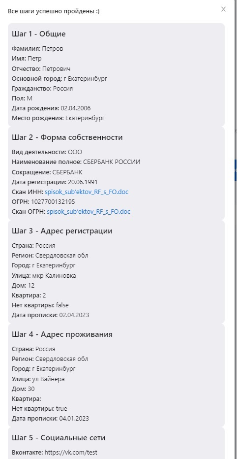

# Приложение форма по шагам

## Технологии: 
:white_check_mark: React, TS, Redux-toolkit, react-hook-form,  styled-components, ant-design.

## Демо: 
https://nimbr133.github.io/form-by-steps/

## Описание: 
Форма создания аккаунта разбита на 5 шагов, на следующей шаг можно попасть, если заполнен предыдущий, можно вернуться назад и отредактировать данные.

Данные после заполнения шага хранятся в Redux и indexDB (localForage), при перезагрузке не теряются данные (в т.ч. файлы). Часть компонентов использованы от ant-design и стилизованы под общий дизайн. 

Для части полей использованы подсказки от api dadata, в т.ч. зависимые подсказки, выбираем страну => по стране подсказки региона => по региону подсказки города и т.д.
Для формы используется react-hook-form, для полей есть валидация и показ ошибки.

### Описание подробно: 
+ Шаг 1.
Для всех полей есть валидация и показ соответствующей ошибки, для города реализованы подсказки от api.

+ Шаг 2.
В верхнем селекте можно выбрать вид деятельности, в зависимости от него покажется нужная форма. Для поля ИНН предусмотрены подсказки и автозаполнение остальных (задизейбленых) полей. Из ant-design взят компонент загрузки файлов и кастомизирован. Загрузить можно файлы до 5мб, которые будут распарсены и сохранены.

+ Шаги 3 и 4.
Реализованы зависимые подсказки, пока не выбрали страну и зависимые поля заблокированы, после выбора поле регион разблокируется и автофокусируется и тд.

+ Шаг 5.
После выбора значения из селекта появляется инпут, возможность добавить новые поля.

+ Конец.
После заполнения всех шагов появится модалка где можно проверить все данные, а файлы скачать обратно, при перезагрузке данные сохраняются, после закрытия модалки будет кнопка для очистки хранилища.

